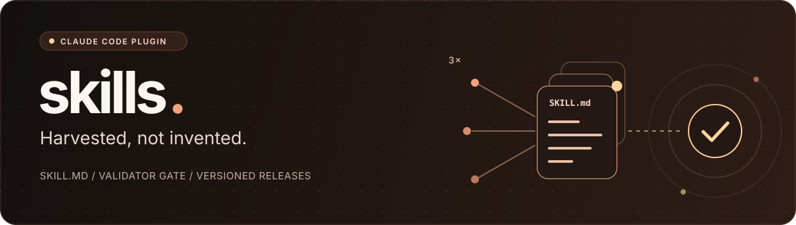

<div align="center">

# skills



### Agent skills for Claude Code. Harvested, not invented.

A [Claude Code](https://code.claude.com/docs/en/plugins) plugin whose skills grow out of
real corrections, and a validator that holds every `SKILL.md` to the same conventions.

[](LICENSE)
[](package.json)
[](.claude-plugin/plugin.json)
[](docs/adr/0002-own-conventions-stricter-than-the-spec.md)

[Quickstart](#quickstart) &nbsp; / &nbsp;
[Skills](#skills) &nbsp; / &nbsp;
[Project setup](#project-setup) &nbsp; / &nbsp;
[Research](#research) &nbsp; / &nbsp;
[Specs](#specs) &nbsp; / &nbsp;
[Tickets](#tickets) &nbsp; / &nbsp;
[Implementation](#implementation) &nbsp; / &nbsp;
[Contributing](CONTRIBUTING.md) &nbsp; / &nbsp;
[Report a bug](https://github.com/64x-lunicorn/skills/issues)

</div>

---

## Skills that earn their place

Most skill collections start from ideas. This one starts from friction: when an assistant needs the same correction for the third time, that correction becomes a skill. Until then it waits in the inbox, word for word.

**A skill exists because it was needed, not because it seemed like a good idea.**

| | What you get |
| :--- | :--- |
| **Harvested from practice** | Every skill traces back to a correction that kept coming up in real work. |
| **Descriptions that fire** | The description is a skill's only API. Vague ones are rejected before they ship. |
| **Conventions, enforced** | 14 deterministic rules check frontmatter, naming, layering, references, evals and the project setup step on every pull request. |
| **Layered on purpose** | User-invoked skills orchestrate; model-invoked skills hold the reusable discipline. |
| **Versioned releases** | Changesets, a changelog and tagged releases. Installed plugins update when the version moves. |

> [!NOTE]
> This collection is young and grows slowly on purpose. It holds twenty-two skills today:
> two for creating the rest, six for setting up projects, three for researching and
> promoting ideas before anything is built, two for writing specs, three for splitting them
> into tickets, five for implementing tickets and verifying the result, and one for commits.
> More arrive as they are harvested.

## How it works

```text
correction  -->  inbox.md  -->  SKILL.md  -->  validator  -->  pull request  -->  release
                    |              |              |
                    |              |              +-- 14 rules, blocks the merge
                    |              +-- written once the same correction was needed 3x
                    +-- recorded word for word, with a counter
```

The validator is deterministic, needs no API access and runs in milliseconds.
Behavioural evals under [`evals/`](evals/) come next; every skill already ships with at
least one case.

## Quickstart

1. Add the marketplace:

```text
/plugin marketplace add 64x-lunicorn/skills
```

2. Install the plugin:

```text
/plugin install 64x-lunicorn@64x-lunicorn
```

Skills trigger on their own when a request matches their description, or run as
`/64x-lunicorn:<skill>`.

## Skills

| Skill | Invocation | What it does |
| :--- | :--- | :--- |
| [`configure-ci-gate`](skills/engineering/configure-ci-gate/SKILL.md) | model-invoked | Generates the workflow with the single required `CI gate`, the ruleset and merge settings, or git hooks without a forge, and reports drift. |
| [`design-http-api`](skills/engineering/design-http-api/SKILL.md) | model-invoked | Designs or changes an HTTP API against fixed REST guidelines and keeps its OpenAPI document, Swagger UI and Bruno collection in the same change. |
| [`design-spec`](skills/engineering/design-spec/SKILL.md) | model-invoked | Drafts a Spec that describes domain behaviour only, with a Mermaid domain flow and Gherkin acceptance criteria. |
| [`design-ticket`](skills/engineering/design-ticket/SKILL.md) | model-invoked | Cuts a Spec into vertical-slice tickets, one pull request each, with the Spec's scenarios as acceptance criteria. |
| [`harvest-skill`](skills/orchestration/harvest-skill/SKILL.md) | user-invoked | Turns a harvested correction or a proven gap into a new skill, wrapping `skill-creator` with the repo's rules. |
| [`implement-ticket`](skills/engineering/implement-ticket/SKILL.md) | model-invoked | Builds one ticket in a fresh agent: reuse inventory, test-first at agreed seams, refactor under green, stop on any deviation. |
| [`implement-tickets`](skills/orchestration/implement-tickets/SKILL.md) | user-invoked | Implements agreed tickets one at a time in wayfinder order, reviewed on two axes, one pull request each. |
| [`interview-user`](skills/engineering/interview-user/SKILL.md) | model-invoked | Interviews Daniel one question at a time, with the open decision count and a recommended answer, and looks facts up instead of asking. |
| [`plan-tickets`](skills/orchestration/plan-tickets/SKILL.md) | user-invoked | Splits an agreed Spec into sub-issue tickets, a reviewed architecture issue and a wayfinder that fixes the order. |
| [`promote-research`](skills/orchestration/promote-research/SKILL.md) | user-invoked | Runs the quality gates on a concluded research object and, on an explicit go, turns it into a self-contained Spec issue. |
| [`research-idea`](skills/orchestration/research-idea/SKILL.md) | user-invoked | Creates or continues a research object under `research/` and leads the discussion of an idea, without implementing it. |
| [`review-architecture`](skills/engineering/review-architecture/SKILL.md) | model-invoked | Reviews the technical approach and order for a Spec's tickets in a forked agent and returns diagrams and proposals. |
| [`review-change`](skills/engineering/review-change/SKILL.md) | model-invoked | Reviews a branch on the spec or the standards axis, including smells and duplication across the codebase, without changing anything. |
| [`setup-project`](skills/orchestration/setup-project/SKILL.md) | user-invoked | Sets up a project through a guided interview with detected defaults, writes the marker every other skill checks, and generates the CI gate, issue templates, agent docs, community files and README from it. |
| [`verify-claims`](skills/engineering/verify-claims/SKILL.md) | model-invoked | Traces factual claims to their primary source and records them with date, version and confidence. |
| [`verify-spec`](skills/engineering/verify-spec/SKILL.md) | model-invoked | Verifies a Spec once all its tickets are merged: scenarios, domain rules, duplication and drift across tickets, leftovers. |
| [`write-agent-docs`](skills/engineering/write-agent-docs/SKILL.md) | model-invoked | Writes `CLAUDE.md`, `CONTEXT.md` and `docs/adr/` with a generated index, keeping recorded conventions, terms and decisions. |
| [`write-commit-message`](skills/engineering/write-commit-message/SKILL.md) | model-invoked | Drafts a Conventional Commits message in English imperative mood for staged changes. |
| [`write-community-files`](skills/engineering/write-community-files/SKILL.md) | model-invoked | Writes the pull request template, CODEOWNERS, SECURITY, CONTRIBUTING and the license, keeping the project's own sections on re-runs. |
| [`write-issue-templates`](skills/engineering/write-issue-templates/SKILL.md) | model-invoked | Writes the user issue templates Bug and Request and keeps the labels to the closed house set, or documents local issue files. |
| [`write-readme`](skills/engineering/write-readme/SKILL.md) | model-invoked | Writes the README in the house skeleton with banner, pitch and fixed sections, keeping the project's own sections on re-runs. |
| [`write-skill`](skills/engineering/write-skill/SKILL.md) | model-invoked | Writes or edits a `SKILL.md` so it triggers reliably and gets followed the same way every run. |
| [`write-spec`](skills/orchestration/write-spec/SKILL.md) | user-invoked | Turns a functional change from a conversation into a Spec issue after light quality gates. |
| [`write-tests`](skills/engineering/write-tests/SKILL.md) | model-invoked | Writes tests first at agreed seams, against independent expected values, mocking only at system boundaries. |

User-invoked skills orchestrate and call model-invoked ones: `harvest-skill` uses
`write-skill`, `setup-project` uses `configure-ci-gate`, `write-issue-templates`, `write-agent-docs`,
`write-community-files` and `write-readme`, `research-idea` uses `verify-claims`, `write-spec` and `promote-research`
use `design-spec`, `plan-tickets` uses `design-ticket` and `review-architecture`,
`implement-tickets` uses `implement-ticket`, which builds with `write-tests`, `review-change`
and `verify-spec`.

## Project setup

Every project starts with `/64x-lunicorn:setup-project`. It detects forge, stack and checks,
asks one question at a time, and writes `.claude/64x-lunicorn.yml`, the marker every other
skill reads. The gate, the issues and the project's documents are generated from that marker, so
the local command, the workflow and the documentation cannot disagree.

```text
interview  -->  .claude/64x-lunicorn.yml  -->  configure-ci-gate      -->  workflow, ruleset, docs/ci-cd.md
                                          -->  write-issue-templates  -->  issue forms, label set
                                          -->  write-agent-docs       -->  CLAUDE.md, CONTEXT.md, docs/adr/
                                          -->  write-community-files  -->  PR template, CODEOWNERS, SECURITY, CONTRIBUTING, LICENSE
                                          -->  write-readme           -->  README.md in the house skeleton
```

| Forge | Gate | Rules on the default branch | Issues |
| :--- | :--- | :--- | :--- |
| GitHub | One matrix job per check, Workflow lint, Secret scan, and `CI gate` as the only required check | Pull request, squash only, signed commits, linear history, no force push | Bug and Request forms, closed label set |
| None | `pre-commit` and `pre-push` hooks run the local command | Direct commits rejected, squash merges pass the gate first | Markdown files in `issues/` |
| GitLab | One job per check, Secret scan, and `CI gate` last; "Pipelines must succeed" blocks | Protected branch, squash always, fast-forward merges; signed commits and code owners are Premium gaps | Bug and Request templates, closed label set |
| Forgejo | Required and advisory matrices, Workflow lint, Secret scan, and `CI gate` as the only required status | Pushes disabled, squash only, up-to-date branch; signed commits when the instance signs merges | Bug and Request forms, closed label set |

A re-run reports every generated file as new, unchanged or drift, and remote settings change only
after an explicit yes. Documents keep the project's own content in project sections, drafted once
and never overwritten, so only the fixed parts can drift. The design is in
[ADR 0010](docs/adr/0010-ci-gate-and-issue-templates.md),
[ADR 0011](docs/adr/0011-readme-community-files-and-agent-docs.md) and
[ADR 0012](docs/adr/0012-gitlab-and-forgejo.md).

## Research

Ideas come long before the decision to build them, and many are never built. Research gives
them a home without letting them slip into implementation unchallenged.

```text
idea  -->  research object  -->  discussion  -->  quality gates  -->  epic / spec  -->  implementation
               |                    |                  |
               |                    |                  +-- the only way out of research
               |                    +-- Daniel's words verbatim, claims verified at the source
               +-- research/NNNN-<slug>/, never implementable on its own
```

Start or continue one with `/64x-lunicorn:research-idea <idea or number>`.

**A research object** is a directory in the repo the idea belongs to, domain or technical:

```text
research/NNNN-<slug>/
  README.md      # question, options incl. "do nothing", findings, recommendation
  sources.md     # every claim with its primary source, date, version, confidence
  discussion.md  # statements verbatim, Claude's proposals marked as such
```

**Lifecycle.** The status lives in the `README.md` frontmatter:

| Status | Meaning |
| :--- | :--- |
| `seed` | Question recorded, nothing explored yet. |
| `exploring` | Options and findings are being collected and discussed. |
| `concluded` | A recommendation stands; open questions are resolved or explicitly accepted. |
| `promoted` | Passed the quality gates and became an epic or spec. Frozen, linked both ways. |
| `parked` | Not now. Kept with the reason. |
| `rejected` | Not at all. Kept with the reason, so the idea does not come back unexamined. |

**Never implementable.** Every object carries `implementable: false`. The only path to code is
promotion through the quality gates: deterministic checks in the validator, and judgement
checks with Daniel (problem in one sentence, "do nothing" considered, explicit go).
`/64x-lunicorn:promote-research` runs them and produces one self-contained Spec issue. The design is in
[ADR 0005](docs/adr/0005-research-objects-before-specs.md); this repo's own research lives
only locally in a gitignored `research/`.

## Specs

A Spec says what the domain does differently afterwards, never how to build it. It is an issue
labelled `spec` and is never implemented directly; the work happens in its sub-issues.

```text
conversation  -->  write-spec  --------+
                                       +-->  design-spec  -->  Spec issue  -->  sub-issues
research object  -->  promote-research +          |
                                                  +-- technical notes, kept for the architecture issue
```

Write one from a conversation with `/64x-lunicorn:write-spec`. It asks for the problem in one
sentence, whether "do nothing" was considered and whether open questions are resolved, then
shows the draft and creates the issue only on an explicit go. Research objects take the
promotion path instead.

**Every Spec** follows one template, held by `design-spec`:

| Section | What it holds |
| :--- | :--- |
| Goal, Problem | Which behaviour changes for whom, and why now. Self-contained. |
| Domain flow | A Mermaid flowchart in domain terms, or `No flow: <reason>`. |
| Behaviour change, Domain rules, Terms | Today versus after, the rules that always hold, the words used. |
| Decisions, Non-goals | Domain decisions with their reasons, rejected options, what is out. |
| Acceptance criteria | Gherkin scenarios for every behaviour change and rule, ready to become integration tests. |
| Open questions and risks, Origin | What was accepted on purpose, and the source with Daniel's words verbatim. |

Technologies, APIs and schemas stay out of the Spec; they are kept as a comment on it for the
architecture issue. The design is in [ADR 0006](docs/adr/0006-specs-describe-domain-behaviour.md).

## Tickets

An agreed Spec is split into work agents can pick up in the right order, with
`/64x-lunicorn:plan-tickets <spec>`.

```text
Spec  -->  cut with Daniel  -->  sub-issues  -->  architecture review  -->  architecture issue  -->  wayfinder
             |                     |                |
             |                     |                +-- forked agent proposes, Daniel decides
             |                     +-- tickets, integration test ticket, architecture issue
             +-- vertical slices, every scenario in exactly one ticket
```

| Issue | Label | What it holds |
| :--- | :--- | :--- |
| Ticket | `task` | One vertical slice, one pull request. Acceptance criteria are the Spec's scenarios, verbatim. |
| Integration test ticket | `task` | Every scenario as a pending test, first in the order. Feature tickets turn their scenarios green. |
| Architecture issue | `architecture` | Components, flow, decisions, ticket dependencies and order, all reviewed against the codebase. |
| Wayfinder | `wayfinder` | Phases, a progress graph and the checklist agents work through. |

Every issue is a sub-issue of the Spec, and dependencies are native "blocked by" relations.
The tickets are agreed before the architecture review, and no proposal of the review is
applied without Daniel's decision. The design is in
[ADR 0007](docs/adr/0007-splitting-specs-into-tickets.md).

## Implementation

Agreed tickets become pull requests with `/64x-lunicorn:implement-tickets <tickets or wayfinder>`.
Slow is steady: one ticket at a time, each in a fresh context, reviewed by agents that did not
write it.

```text
wayfinder  -->  tickets  -->  implement-ticket  -->  review-change  -->  pull request  -->  Daniel merges
                  |               |                      |
                  |               |                      +-- spec and standards axes, fresh agents
                  |               +-- fresh agent, reuse inventory, test-first, refactor under green
                  +-- checked, read back, one at a time
```

| Guard | Against |
| :--- | :--- |
| Seams from the architecture issue, or a stop | Tests against internals, code nobody agreed on |
| Reuse inventory before the first test, duplication search in review | Duplicated code |
| Refactor under green tests in every ticket | Smells left for later |
| Diff checked against the implementation notes after every green | Scope and architecture drift |
| Spec axis and standards axis in separate forked reviews | Deviations from the Spec, self-biased review |
| Hard findings fixed and re-reviewed, judgement calls decided by Daniel | Findings nobody acts on |
| One pull request per ticket, wayfinder reconciled on the next run | Tickets that never close, blocked work that never unblocks |
| `verify-spec` over the whole Spec once every ticket is merged | Duplication and drift between tickets, leftovers, Specs that never close |

A stop is shown to Daniel and posted on the wayfinder, never worked around. Merging stays with
Daniel. When the wayfinder is fully checked off, the next run verifies the Spec as a whole:
findings become follow-up tickets, and a clean result closes the Spec, its architecture issue
and its wayfinder on Daniel's go. The design is in
[ADR 0008](docs/adr/0008-implementing-tickets.md) and
[ADR 0009](docs/adr/0009-verifying-and-closing-a-spec.md).

## The validator

```bash
npm ci
npm run validate
```

Every finding names its rule, the file and line, and the reason:

```text
SK003 skills/engineering/write-commit-message/SKILL.md:3 description has 24 characters, at least 60 are required.
```

The full rule catalogue, the frontmatter allowlist and the reasoning behind each threshold
live in [ADR 0002](docs/adr/0002-own-conventions-stricter-than-the-spec.md).

## Documentation

| Guide | Start here when you want to... |
| :--- | :--- |
| [CLAUDE.md](CLAUDE.md) | Learn the conventions no validator can check, and how a new skill is added. |
| [CONTEXT.md](CONTEXT.md) | Look up a term: harvest, layering, Gate A, rule ID, research object, promotion, Spec, ticket, wayfinder, seam, Spec verification, marker, CI gate, project section. |
| [Architecture decisions](docs/adr/) | Understand why this is a plugin, why the rules are stricter than the spec, why skills are created with own skills only, why research comes before specs, why specs describe domain behaviour, how they are split into tickets, how tickets are implemented, how a Spec is verified and closed, and how the CI gate and issue templates are set up, how README, community files and agent docs are generated, and how GitLab and Forgejo are supported. |
| [GitHub setup](docs/setup-github.md) | Reproduce the branch protection, signing and release flow. |
| [Changelog](CHANGELOG.md) | See what changed in each release. |
| [CI/CD](docs/ci-cd.md) | Understand the gate, run it locally and see the rules on `main`. |
| [Contributing](CONTRIBUTING.md) | Set up development, run the checks and submit a focused change. |
| [Security policy](SECURITY.md) | Report a vulnerability privately. |

## Contributing

Bug reports and focused pull requests are welcome. Run the whole gate locally before pushing:

```bash
npm run ci
```

Harvest candidates are welcome: new skills start as an [issue](https://github.com/64x-lunicorn/skills/issues) describing the correction that keeps coming up, and validator rules are added through TDD.

Use synthetic data in examples, tests and issues. See [CONTRIBUTING.md](CONTRIBUTING.md) for the checks and what a change needs.

## License and credits

skills is licensed under the **[MIT License](LICENSE)**.
The copyright notice is **Copyright (c) 2026 64x-lunicorn**.

The repository layout and skill taxonomy take their cue from
[Matt Pocock's skills collection](https://github.com/mattpocock/skills). No files are copied
from it.
