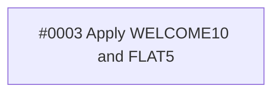

# Architecture: Order pricing

> Technical design for the tickets of Spec #0001. Order of work: #0004.

## Decisions

- **`apply_discount` is the one place discount codes are looked up and applied.** Every caller passes an order total and a code and gets back the discounted total.

## Ticket dependencies

