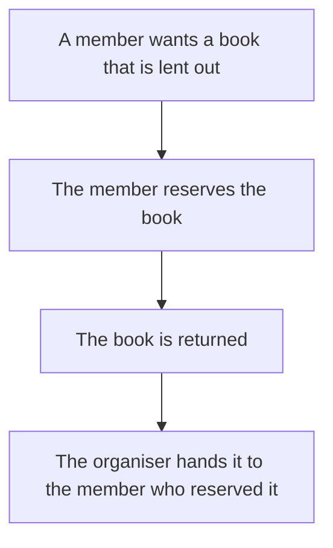

# Spec: Reservations

> [!IMPORTANT]
> This Spec describes domain behaviour. It is never implemented directly; the work happens only in its sub-issues.

## Goal

A member can reserve a book that is lent out and gets it next when it is returned.

## Problem

Members cannot claim a book that is lent out, so whoever asks the organiser first after its return gets it.

## Domain flow



## Domain rules

- A book that is not lent out cannot be reserved.
- A returned book with a reservation goes to the member who reserved it.

## Terms

- **Member**: a person registered with the lending circle who may borrow books.
- **Loan**: one book lent to one member, from hand-over until its return.
- **Reservation**: a member's claim on a book that is currently lent out; the member gets the book next when it is returned.

## Acceptance criteria

```gherkin
Feature: Members reserve books that are lent out

  Scenario: A member reserves a book that is lent out
    Given a book is lent out to one member
    When another member reserves the book
    Then the reservation is recorded for that member

  Scenario: A returned book goes to the member who reserved it
    Given a book with a reservation is lent out
    When the book is returned
    Then the organiser is shown the member who reserved it
```
