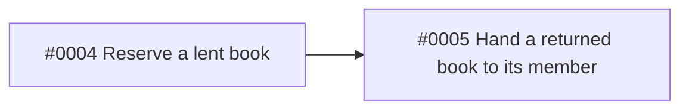

# Architecture: Reservations

> Technical design for the tickets of Spec #0001. Order of work: #0003.

## Context

Loans live in the SQLite file from ADR 0001. A reservation is one more table next to the loans.

## Decisions

- **A reservation is a row in a `reservations` table with the book and the member.** One open reservation per book; the loan code reads it on return.

## Ticket dependencies

