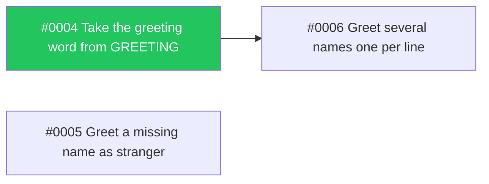

> Order of work for Spec #0001. Architecture: #0002.

# Wayfinder: Friendly greetings

## Progress

## Phases

### Phase 1: Greeting word and missing name

- [x] #0004 Take the greeting word from GREETING
- [ ] #0005 Greet a missing name as stranger

### Phase 2: Several names

- [ ] #0006 Greet several names one per line, blocked by #0004

## Update stops

- Update stop for #0005: checks still red after the push.
