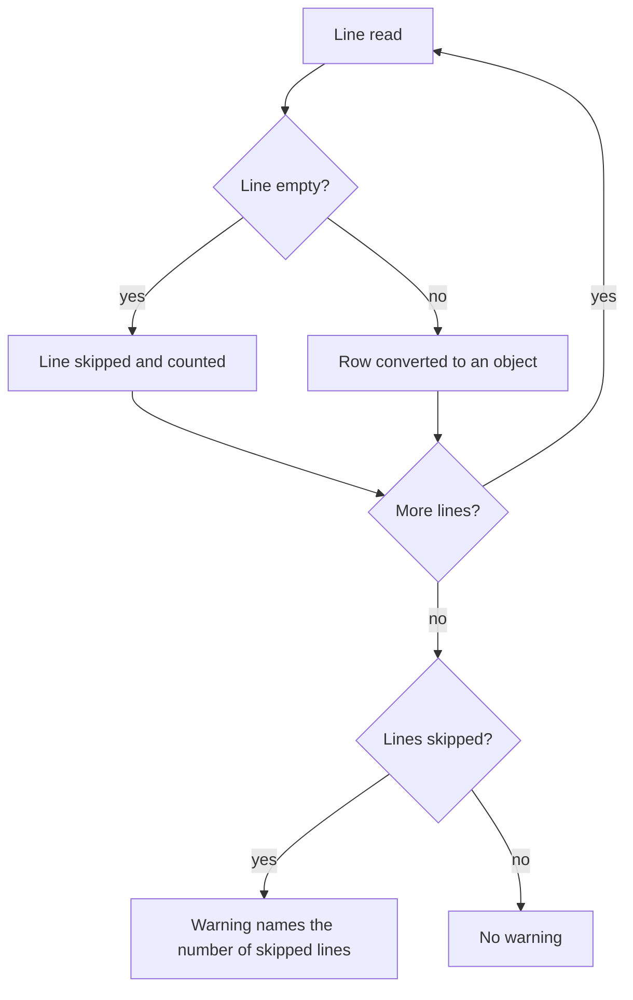

# Spec: Skip empty lines

> [!IMPORTANT]
> This Spec describes domain behaviour. It is never implemented directly; the work happens only in its sub-issues.

## Goal

csv2json skips empty lines in a CSV file instead of turning them into empty JSON objects, and tells the user how many lines it skipped.

## Problem

Exports from common accounting tools end with empty lines. csv2json turns each of them into `{}` at the end of the array, and every consumer has to filter them out.

## Domain flow



## Domain rules

- A line that holds nothing or only whitespace is empty.
- An empty line never becomes an object in the output.
- When lines were skipped, one warning on stderr names how many.
- A line of only separators, such as `,,`, is not empty; it becomes an object with empty values.

## Non-goals

- Skipping rows whose values are all empty.
- A flag to keep empty lines.

## Acceptance criteria

```gherkin
Feature: csv2json skips empty lines

  Scenario: An empty line is skipped
    Given a CSV file with an empty line between two rows
    When it is converted
    Then the output holds two objects

  Scenario: A whitespace line is skipped
    Given a CSV file with a line of three spaces between two rows
    When it is converted
    Then the output holds two objects

  Scenario: Skipped lines are counted in one warning
    Given a CSV file that ends with two empty lines
    When it is converted
    Then stderr shows one warning that 2 lines were skipped

  Scenario: No warning without skipped lines
    Given a CSV file without empty lines
    When it is converted
    Then stderr shows no warning

  Scenario: A line of separators is kept
    Given a CSV file with the header "a,b" and a line ",,"
    When it is converted
    Then the output holds one object with empty values for a and b
```

## Technical notes for the architecture issue

- The parser in `src/parse.js` reads lines one by one; the warning belongs to `src/cli.js`, which owns stderr.
- The existing tests live in `test/parse.test.js` and use `node --test`.
