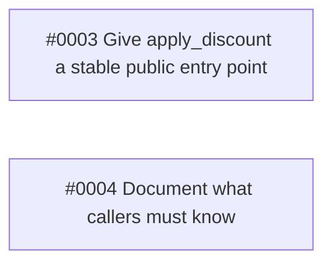

# Architecture: A real interface for discount handling

> Technical design for the tickets of Spec #0001. Order of work: #0005.

## Context

`src/billing/apply_discount.sh` already holds every discount rule; `src/commands/checkout.sh`, `refund.sh` and `quote.sh` call it and pass through whatever it returns without branching on a code themselves.

## Decisions

_To decide in review: how #0003 and #0004 are ordered, and what each ticket's implementation notes should say about where behaviour is observed and what a caller must know._

## Ticket dependencies

