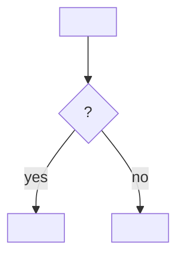

# Spec template

Read when drafting a Spec. Replace every `<…>` and delete comments. Title of the issue: `Spec: <title>`. Label: `spec`.

````markdown
> [!IMPORTANT]
> This Spec describes domain behaviour. It is never implemented directly; the work happens only in its sub-issues.

## Goal

<One sentence: which behaviour changes, and for whom.>

## Problem

<Why now, what the current behaviour costs, and the findings that matter. Enough that nobody has to read the source conversation or research object.>

## Domain flow



<!-- When the change has no sequence or decision, replace the diagram with: No flow: <reason>. -->

## Behaviour change

| Situation | Today | After |
|---|---|---|
| <situation> | <current behaviour> | <new behaviour> |

## Domain rules

- <rule that must always hold, independent of any screen or code>

## Terms

- **<term>**: <meaning>

## Decisions

- **<domain decision>.** <reason>

Rejected:

- <option>: <one line why not>

## Non-goals

- <explicitly not part of this Spec>

## Acceptance criteria

```gherkin
Feature: <goal in domain terms>

  Scenario: <one behaviour or rule>
    Given <domain state>
    When <domain event or action>
    Then <observable outcome>
```

## Open questions and risks

- <open question accepted by Daniel, or known risk accepted on purpose>

## Origin

<Research object `NNNN-<slug>`, promoted YYYY-MM-DD. | Conversation of YYYY-MM-DD.>

Daniel's statements, verbatim:

> <statement in the language it was given in>
````
