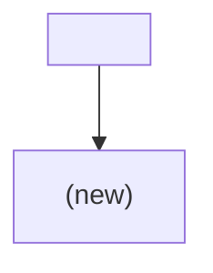
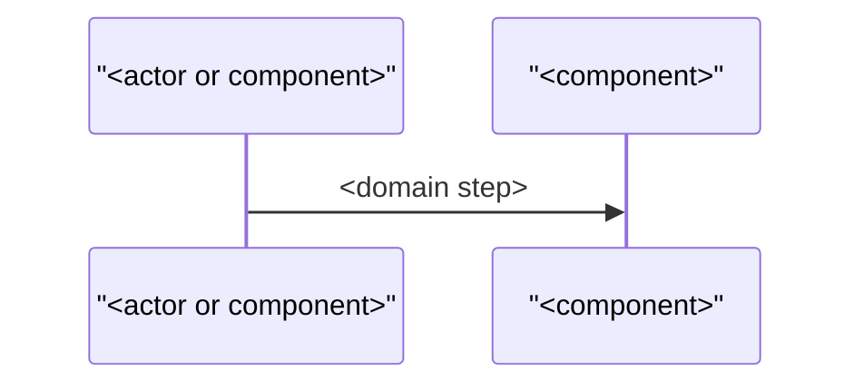
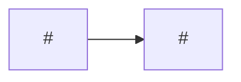

# Architecture template

Read when filling the architecture issue body. Replace every `<…>` and delete comments. Title: `Architecture: <Spec title>`. Label: `architecture`.

````markdown
> Technical design for the tickets of Spec #<spec>. Order of work: #<wayfinder>.

## Context

<The Spec's goal in one sentence, and the constraints from the codebase that shape the design.>

## Technical notes

<The technical notes from the Spec, verbatim.>

## Components



## Flow



## Decisions

- **<technical decision>.** <reason>

Rejected:

- <option>: <one line why not>

## Ticket dependencies



## Implementation order

| Phase | Tickets | Parallel | Reason |
|---|---|---|---|
| 1 | #<n> | <yes / no> | <why this comes first> |

## Risks

- <technical risk and how the order or design limits it>

## Review log

### <YYYY-MM-DD>

- Proposal <n>: <change>. Daniel: "<decision, verbatim>"
````
