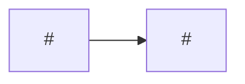

# Wayfinder template

Read when creating the wayfinder in step 6. Replace every `<…>` and delete comments. Title: `Wayfinder: <Spec title>`. Label: `wayfinder`.

````markdown
> Order of work for Spec #<spec>. Architecture: #<architecture>.

## How to work from this issue

1. Take the first unchecked ticket whose blockers are all closed. Tickets in the same phase can run in parallel.
2. Read the ticket, the Spec and the architecture issue before starting.
3. When the ticket's pull request is merged, check it off here and mark its node `done` in the graph.
4. When a ticket turns out wrong or is blocked by something not planned, stop and comment on this issue. Changing the order is Daniel's decision.

## Progress



## Phases

### Phase 1: <name>

<Reason from the architecture review.> Parallel: <yes / no>.

- [ ] #<n> <title>

### Phase 2: <name>

<Reason.> Parallel: <yes / no>.

- [ ] #<n> <title>, blocked by #<n>
````
